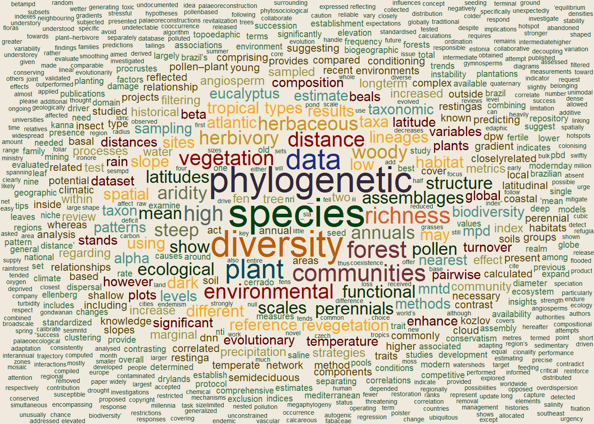

#### Hi, I'm Jhonny. I am Aurora's dad, Katy's husband, and an ecologist currently working as a post-doctoral researcher in macroecology.

I am a curious person. We are all born curious. I realised my innate sense of **Curiosity** serves as an asset throughout my professional journey. It has guided me through different career paths and seemingly unrelated projects.

I've discovered that **Biodiversity** is the crucial link connecting my **Curiosity** to my academic interests. This connection becomes evident in the word cloud below. It showcases my academic contributions and the significance of **Biodiversity** in my research endeavours.

When I am not at work, I like to stay with my family, travelling, hiking, and reading. Have a look at the books I am reading right now at *Readings*. Ah, I love sunsets!

Since July 2022, I have been dedicated to developing a project centred around rare species and their contribution to ecological communities. For more details, have a look at *About*.

##### My academic interests in a word cloud

::: {.cell}
::: {.cell-output-display}
{width=672}
:::
:::

Word cloud made with the abstracts of scientific papers I have published, either as a first author or as a collaborator.

